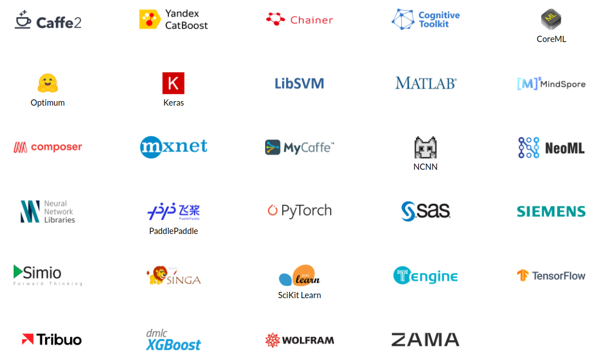

# How to develope a model from scratch?
This document provides best ways to develope a deep learning model from scratch to be used with our pipeline. We tried to answer this question very generally. Feel free to contribute to this guide!

**Contents:**
+ [Chossing framework](#choosing-framework)
+ [Training model](#training-model)
+ [Conversion to ONNX](#conversion-to-onnx)
    + [PyTorch](#pytorch)
    + [TensorFlow](#tensorflow)
+ [Check converted model](#check-converted-model)
+ [Conclusion](#conclusion)

## Choosing framework
You can use any framework that is compatible with ONNX. The final product of model training must be converted to an ONNX model. Later this model is loaded to be run. Almost all major frameworks support conversion to ONNX model. The following figures shows the list of supported framework (from [ONNX website](https://onnx.ai/supported-tools.html#buildModel)):


Our suggestion is to use **PyTorch** for training. However, we have tested both PyTorch and TensorFlow.
## Training model
After choosing your framework, training procedure begins. The only limitation you should consider is that some operations are not supported in ONNX and ONNXRuntime (ORT). To show which version of ORT and ONNX support what operations, the concept of "opset" is defined. Each ONNX version corresponds to an opset version. For more information on opset you can refer to [this document](https://github.com/onnx/onnx/blob/main/docs/Versioning.md). Also all supported operations of ONNXRuntime are specified with a opset version that could be found in [this document](https://github.com/microsoft/onnxruntime/blob/main/docs/OperatorKernels.md). In our experience, we found out that most operations of computer vision models are supported and there might be some limitation in NLP tasks. As a rule of thumb, most common operations are supported. However, if you found a model proposed in 2022 and uses a new operation, probably it's not supported. 
## Conversion to ONNX
By this section, you have trained your model in your favorite pipeline and saved your best model. In this step, you will convert it to the ONNX format. We only present conversion commands for PyTorch and TesnsorFlow models. For other frameworks, refer to their documentation.
### TensorFlow
For TensorFlow models, you need `tf2onnx` module in Python. You can install it via pip:
```bash
pip install tf2onnx
```
You can find documentation of `tf2onnx` in this [github repo](https://github.com/onnx/tensorflow-onnx).

After installing `tf2onnx`, you can easily convert your model with the following command:
```bash
python -m tf2onnx.convert --saved-model <path to tensorflow model> --output model.onnx
```
ONNX opset version can also be specified with `--opset <version>` flag. Run `python -m tf2onnx.convert` for CLI usage. You can also refer to [tf2onnx repository](https://github.com/onnx/tensorflow-onnx) for more advanced usages.
### PyTorch
PyTorch supports ONNX without any extra dependecies. PyTorch module name for ONNX is `torch.onnx`. A simple example of converting your model to ONNX is presented here:

```python
import torch
import torchvision

dummy_input = torch.randn(10, 3, 224, 224, device="cuda")
model = torchvision.models.alexnet(pretrained=True).cuda()

input_names = [ "actual_input_1" ] + [ "learned_%d" % i for i in range(16) ]
output_names = [ "output1" ]

torch.onnx.export(model, dummy_input, "alexnet.onnx", verbose=True, input_names=input_names, output_names=output_names)
```
In this snippet, the alexnet model is loaded and converted to ONNX model. PyTorch model is run once so that execution graph can be created. Therefore, you should provide an arbitrary input to the model (`dummy_input` in the snippet). Also, input and output name can be specified. For a more detailed explanation and usage, check out [PyTorch documentation](https://pytorch.org/docs/stable/onnx.html). Also for a complete example of model training and conversion in PyTorch, refer to [this webpage](https://pytorch.org/tutorials/advanced/super_resolution_with_onnxruntime.html).
### Check converted model
With `onnx` module in Python, you can check the validity of your converted model. The following snippet shows how to do so:
```python
import onnx

model = onnx.load("model.onnx") # model name
onnx.checker.check_model(model)
print(onnx.helper.printable_graph(model.graph))
```
Also you can use `Netron` to see model graph in a prettier manner. For more information on how to use Netron, refer to the [Netron repo](https://github.com/lutzroeder/netron).

## Conclusion
In this document we discussed best ways to train your model so that later it can be integrated with our pipeline. By the end of this document, you have trained your model in a framework compatible with ONNX and then converted it to ONNX model. Now, you should have an ONNX model that will be run in the ONNXRuntime. For a guide on how to used this model with our pipeline, refer to [this document](./use-existing-models.md)
